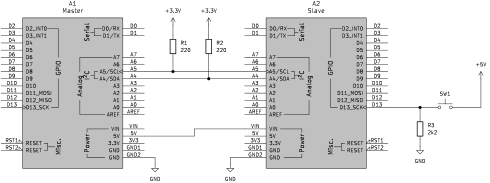

# Comunicación entre 2 Arduinos Nano vía i²C (TWI)

## Conexionado

Para ejecutar el test se requerirá:

- Resistencias de 220 Ω: 2
- Resistencia de 2200 Ω: 1
- Pulsador normal cerrado.
- Cables varios.

Las  conexiones se muestran en la siguiente imagen:

## Ejecución

### Cargar el programa

1. Abrir una terminal y posicionarse en la carpeta raíz del proyecto.
2. Compilar el programa del esclavo con `make twi-slave-test`.
3. Conectar el esclavo a la PC y flashear el programa con `make flash`.
4. Desconectar el esclavo y ejecutar `make clean`.
5. Compilar el programa del maestro con `make twi-master-test`.
6. Conectar el maestro a la PC y flashear el programa con `make flash`.
7. Ejecutar `make clean` para borrar los archivos de build. *(Opcional)*

### Funcionamiento

> [!IMPORTANT]
> Para el correcto funcionamiento, al menos uno de los arduinos debe quedar conectado a la PC o ser alimentado de otra manera.

El comportamiento esperado es el siguiente: Mientras el pulsador externo conectado al esclavo esté presionado, deberá encenderse el LED de la placa del maestro. Liberar el pulsador debería apagar el LED. \
A nivel lógico, el maestro continuamente solicitará un byte del esclavo y el esclavo responderá siempre con un byte que depende del estado del pulsador. Si el byte transmitido es 1 (caso en el que se esté presionando el pulsador), el maestro encenderá el LED, por el contrario, si es cero (pulsador liberado), el maestro apagará el LED.
