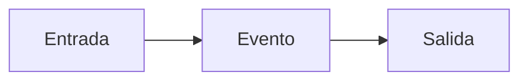

# Diseño del sistema

## Funcionamiento general

El panel de instrumentos tiene dos funcionalidades: inyectar eventos en el simulador a través de las entradas y mostrar información asociada a eventos que ocurren en el simulador a través de las salidas.

El caso más general de una situación es aquel donde una entrada genera un evento para el cual se espera una salida. En ese caso, el flujo de ejecución es:

>[!Important]
> Nunca una salida puede ser una consecuencia directa de una entrada. Siempre debe existir un evento que la genere. Esto porque es posible que el evento que debería generar una entrada no suceda finalmente en el simulador.

## Detalles de implementación

**Resumen de estructuras:**

- changed_inputs
- buf
- outputs

**Resumen de tareas:**

- `main()`
- `get_inputs()`
- `send_inputs()`
- `update_outputs()`
- `set_outputs()`

**Resumen de semáforos:**

- new_byte
- new_word
- word_consumed

### Explicación general

A continuación se presenta un diagrama en bloques general del sistema.

#### Entradas

Las entradas se pueden accionar de dos maneras: una mediante una matriz de botones que se comunica con el maestro vía I²C y la otra mediante un encoder conectado directamente a uno de los pines del maestro.

Todas las entradas son del tipo ON/OFF. La única excepción es la entrada del encoder que tiene asociado un valor entre 0 y 200. Además, todas las entradas se identifican mediante un ID que va de 0 a 35, siendo 35 el ID del encoder.

El programa en Python de la PC que se comunica con el simulador, almacena el estado de todas las entradas (un par ID-Valor). Cómo casi todas las entradas son binarias, el maestro debe transmitir simplemente el ID de las entradas que hayan conmutado su estado. En el caso de la entrada el encoder, se transmitirá la suma de su ID y el valor de la entrada. De esta manera se puede distinguir esta entrada del resto y recuperar su valor luego restando 35.

La tarea periódica `get_inputs()` recibe los IDs de las entradas que hayan conmutado su estado en la matriz de botones. Dichas IDs se almacenan temporalmente en la cola `changed_inputs` para ser transmitidas luego.

Por otro lado, si se activa el encoder, se generará una interrupción. Luego, en la rutina de atención de interrupciones `ISR(INT0_VECT)` se actualizará el valor de la entrada para poder ser transmitida junto con los valores de la cola.

##### Transmisión de las entradas

Periódicamente se activará la tarea `send_inputs()` que envía la actualización de las entradas por serial. Primero se mandan todos los datos presentes en la cola y por último se envía la entrada del encoder, independientemente de si sufrió cambios.
